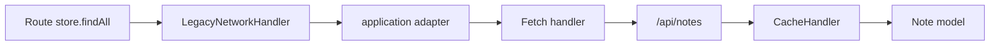

# Bump ember-data to v5 and fix store setup

## Problem

`pnpm test:ember` fails at build time:

```
unable to resolve package @ember-data/store
```

The dummy app already has a v5-style store at [`tests/dummy/app/services/store.js`](tests/dummy/app/services/store.js), but [`package.json`](package.json) still pins `ember-data` at `~4.12.8`. With Embroider + pnpm, direct `@ember-data/*` imports from app code must resolve to installed packages — and the current store imports `@ember-data/store` as the base class instead of the documented `ember-data/store` entry point.

## Target versions

- `ember-data`: `~5.9.1` (latest stable 5.x; compatible with `ember-source ~6.7.0` and `@ember/test-helpers ^5.2.2`)
- Matching explicit packages (same version): `@ember-data/request`, `@ember-data/legacy-compat`, `@ember-data/store`

## Changes

### 1. Bump dependencies in [`package.json`](package.json)

```json
"ember-data": "~5.9.1",
"@ember-data/legacy-compat": "~5.9.1",
"@ember-data/request": "~5.9.1",
"@ember-data/store": "~5.9.1"
```

Run `pnpm install` to refresh [`pnpm-lock.yaml`](pnpm-lock.yaml).

Existing adapter/serializer/model files can stay unchanged — they use legacy JSON:API APIs that `LegacyNetworkHandler` preserves:
- [`tests/dummy/app/adapters/application.js`](tests/dummy/app/adapters/application.js)
- [`tests/dummy/app/serializers/application.js`](tests/dummy/app/serializers/application.js)
- [`tests/dummy/app/models/note.js`](tests/dummy/app/models/note.js)

### 2. Fix store service per [WarpDrive incremental adoption guide](https://canary.warp-drive.io/guides/the-manual/cookbook/incremental-adoption-guide)

Update [`tests/dummy/app/services/store.js`](tests/dummy/app/services/store.js):

- Import `Store` from `ember-data/store` (not `@ember-data/store`)
- Use class-field `requestManager` (not constructor assignment)
- Keep `LegacyNetworkHandler` + `Fetch` + `CacheHandler` chain for existing `store.findAll` / `store.findRecord` usage

```js
// eslint-disable-next-line ember/use-ember-data-rfc-395-imports
import Store from 'ember-data/store';
import { CacheHandler } from '@ember-data/store';
import { LegacyNetworkHandler } from '@ember-data/legacy-compat';
import RequestManager from '@ember-data/request';
import Fetch from '@ember-data/request/fetch';

export default class StoreService extends Store {
  requestManager = new RequestManager()
    .use([LegacyNetworkHandler, Fetch])
    .useCache(CacheHandler);
}
```

### 3. Keep existing Embroider config

No change needed to [`ember-cli-build.js`](ember-cli-build.js) — the `@ember-data/store` `polyfillUUID` macro config remains valid.

### 4. Verify tests

```bash
pnpm test:ember
```

Focus on [`tests/fastboot/network-mocking-test.js`](tests/fastboot/network-mocking-test.js) — it exercises `store.findAll`, `store.findRecord`, JSON:API mocks, and 404 error messages.

## Out of scope (not required for `test:ember`)

The branch has unresolved merge conflicts in [`tests/dummy/config/ember-try.js`](tests/dummy/config/ember-try.js), [`.github/workflows/ci.yml`](.github/workflows/ci.yml), and [`README.md`](README.md). These do not block `ember test` locally but should be resolved before merging.


